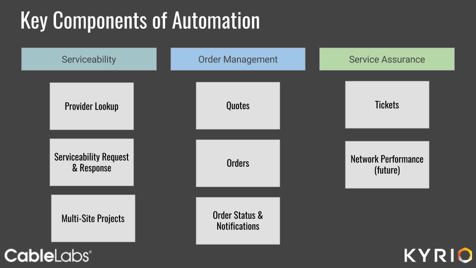
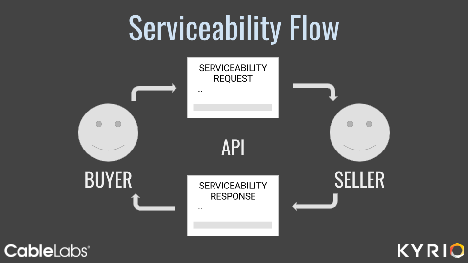

# Business Services Automation Serviceability API

This repository contains the Serviceability API to support interactions on the Business Services Automation platform hosted by CableLabs/Kyrio.

Serviceability is one component group of the overall Business Services Automation flow as illustrated below:

Serviceability provides an API to help determine if a particular service is available (or could be made available) via a particular medium (e.g. Fiber, HFC) at a particular location by a particular Seller. Serviceability also provides fluid transitions to the quoting and site survey processes. The result of a Serviceability Request is a Serviceability Response that contains Product Offerings (quotations) that the Buyer may order from the Seller.

> **IMPORTANT**: This project is in pre-release development. Please expect frequent changes and updates.

**Repository Structure**

| Folder | Contents |
| ------ | -------- |
| `/documentation` | Markdown files containing documentation for this repository. |
| `/endpoints` | JSON files that describe the various API endpoints |
| `/example-data` | Example JSON files for Serviceability |
| `/schemas` | JSON Schema files for Serviceability |

The Endpoint Summary table found on the following pages describes each Serviceability API endpoint. Following the table is an example of each action at each endpoint, including sample request and response payloads.

Serviceability API is divided into a [Serviceability Request API](./documentation/serviceability-request-api.md) and a [Serviceability Response  API](./documentation/serviceability-response-api.md)

## Other important stuff

We use an [MIT License](LICENSE).
